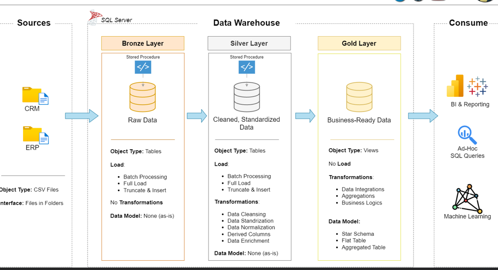
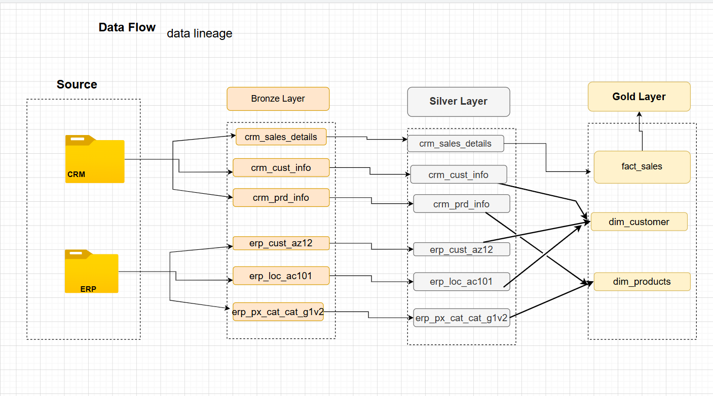
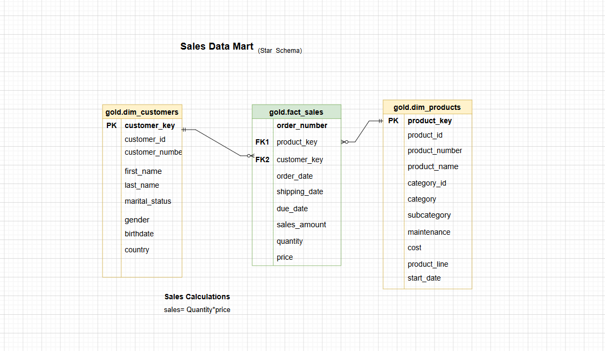

# 🏢 SQL Data Warehouse Project | SQL Server
 
> Developed as part of a guided SQL Data Warehouse course by Bara Saklani, providing hands-on experience in ETL development, data modeling, and analytical data warehousing.

---
## 📌 Table of Contents

- [📖 Project Overview](#-project-overview)
- [🎯 Business Problem](#-business-problem)
- [🏗️ Data Architecture](#️-data-architecture)
- [📂 Data Sources](#-data-sources)
- [🔄 ETL Pipeline](#-etl-pipeline)
- [📊 Data Model](#-data-model)
- [✅ Data Quality Checks](#-data-quality-checks)
- [📊 Analytical Layer (EDA & Advanced Analytics)](#-analytical-layer-eda--advanced-analytics)
- [🛠️ Technologies Used](#️-technologies-used)
- [📊 SQL Techniques & Analytical Methods](#-sql-techniques--analytical-methods-used)
- [🚀 How to Run This Project](#-how-to-run-this-project)
- [🎯 Key Skills Demonstrated](#-key-skills-demonstrated)

---


## 📖 Project Overview
This project demonstrates the end-to-end development of a modern Data Warehouse using SQL Server. The solution consolidates data from multiple source systems, applies data quality and transformation processes, and delivers a business-ready analytical model for reporting and decision-making.

The project follows the Medallion Architecture (Bronze, Silver, and Gold layers) to ensure scalability, maintainability, and data quality throughout the pipeline. 


---


## 🎯 Business Problem

Business data is often scattered across multiple operational systems, making reporting inconsistent and difficult.

This project solves that problem by integrating CRM and ERP data into a centralized SQL Server Data Warehouse, enabling reliable analytics and decision-making.

---

## 🏗️ Data Architecture

This project follows the **Medallion Architecture** design pattern consisting of Bronze, Silver, and Gold layers.



### Bronze Layer – Raw Data

The Bronze Layer serves as the landing zone for source data.

**Responsibilities**

- Store raw data in its original format.
- Load source CSV files into SQL Server.
- Preserve source-system data for traceability.
- Perform minimal processing.

### Silver Layer – Cleansed & Standardized Data

The Silver Layer transforms raw data into clean and reliable datasets.

**Responsibilities**

- Data cleansing
- Data standardization
- Data normalization
- Duplicate removal
- Data validation
- Business rule implementation

### Gold Layer – Business-Ready Data

The Gold Layer contains curated datasets optimized for analytics and reporting.

**Responsibilities**

- Dimensional modeling
- Fact table creation
- Dimension table creation
- Business metric generation
- Reporting optimization

---

## 📂 Data Sources

The data warehouse integrates data from two business systems.

### CRM System

Customer-related data including:

- Customer information
- Customer demographics
- Customer master records

### ERP System

Operational and sales-related data including:

- Product information
- Sales transactions
- Business operations data

### Source Format

- CSV Files

---

## 🔄 ETL Pipeline

The project implements a complete Extract, Transform, and Load (ETL) workflow.


### Extract

- Import source CSV files.
- Load raw data into Bronze tables.
- Validate source file availability.

### Transform

- Clean inconsistent values.
- Standardize formats.
- Resolve data quality issues.
- Remove duplicate records.
- Apply business transformation rules.
- Integrate CRM and ERP datasets.

### Load

- Populate Silver tables.
- Build Gold analytical tables.
- Create Fact and Dimension tables.
- Prepare data for reporting and analytics.

---

## 📊 Data Model

The Gold Layer follows a **Star Schema** design optimized for analytical workloads.


### Fact Table

#### Fact Sales

Stores transactional sales measures including:

- Sales Amount
- Quantity Sold
- Order Details

### Dimension Tables

#### Dim Customer

Stores customer-related descriptive attributes.

#### Dim Product

Stores product-related descriptive attributes.

#### Dim Date

Stores calendar and date-related attributes.


### Benefits

- Improved query performance
- Simplified reporting
- Faster analytical queries
- Enhanced business insights

---


## ✅ Data Quality Checks

The project includes multiple validation checks to ensure data integrity and consistency.

### Implemented Checks

- Primary Key Validation
- Duplicate Detection
- Null Value Validation
- Referential Integrity Checks
- Fact-to-Dimension Relationship Validation
- Data Consistency Verification


----

## 📊 Analytical Layer (EDA & Advanced Analytics)

After building the Gold Layer, exploratory and advanced SQL analysis was performed to generate meaningful business insights and validate the data model.

This layer focuses on transforming structured warehouse data into actionable insights for reporting and decision-making.

### 🎯 Key Analytical Areas
- 📈 Sales trend analysis (monthly, yearly, seasonality patterns)
- 👥 Customer behavior analysis (new vs returning customers, segmentation)
- 🛍️ Product performance analysis (top/bottom-selling products)
- 🌍 Geographic sales distribution
- 💰 Revenue and KPI tracking (total sales, quantity, average order value)
- ⏱️ Time-based analysis using date dimensions
- 🧠 Advanced SQL techniques (window functions, ranking, aggregation)

### 📌 Example Use Cases
- Identifying top 10 customers by revenue
- Finding best-performing product categories
- Tracking monthly revenue growth trends
- Analyzing sales contribution by region
- Detecting underperforming products


---


## 🛠️ Technologies Used

| Category | Technology |
|-----------|------------|
| Database | SQL Server |
| Query Language | T-SQL |
| Development Tool | SQL Server Management Studio (SSMS) |
| Data Source | CSV Files |
| Architecture | Medallion Architecture |
| Data Modeling | Star Schema |
| ETL Development | SQL-Based ETL Pipelines |

## 📊 SQL Techniques & Analytical Methods Used

- Aggregate functions (`SUM`, `COUNT`, `AVG`)
- Window functions (`RANK`, `DENSE_RANK`, `LAG`)
- Common Table Expressions (CTEs)
- Joins across fact and dimension tables
- Time intelligence using Date dimension
---


## 🚀 How to Run This Project

### 1. Create the Database
Execute the script located in:

```text
scripts/init.database.sql
```

### 2. Create Bronze Layer Objects

Execute all scripts located in:

```text
scripts/bronze/
```

### 3. Load Bronze Data

Run the Bronze ETL procedures to ingest source CSV files.

### 4. Create Silver Layer Objects

Execute all scripts located in:

```text
scripts/silver/
```

### 5. Load Silver Data

Run the Silver ETL procedures to cleanse and standardize the data.

### 6. Create Gold Layer Objects

Execute all scripts located in:

```text
scripts/gold/
```

### 7. Validate Data Quality

Run the scripts located in:

```text
tests
```

### 8. Query Gold Layer

Use Gold Layer views and tables for reporting and analytics.

----
### 🚀 Exploratory & Advanced Analytics

Execute scripts located in:

```text
scripts/eda_and_advanced_data_analytics/
```


---

## 🎯 Key Skills Demonstrated

- ETL pipeline development using SQL Server and T-SQL
- Data cleansing, validation, and transformation
- Medallion Architecture implementation (Bronze, Silver, Gold)
- Star Schema dimensional modeling
- Fact and Dimension table design
- Data quality and integrity validation
- Analytical data warehouse development
- Exploratory and advanced SQL analytics using window functions and CTEs


---

## 👨‍💻 Author

**Sapna Devi**


